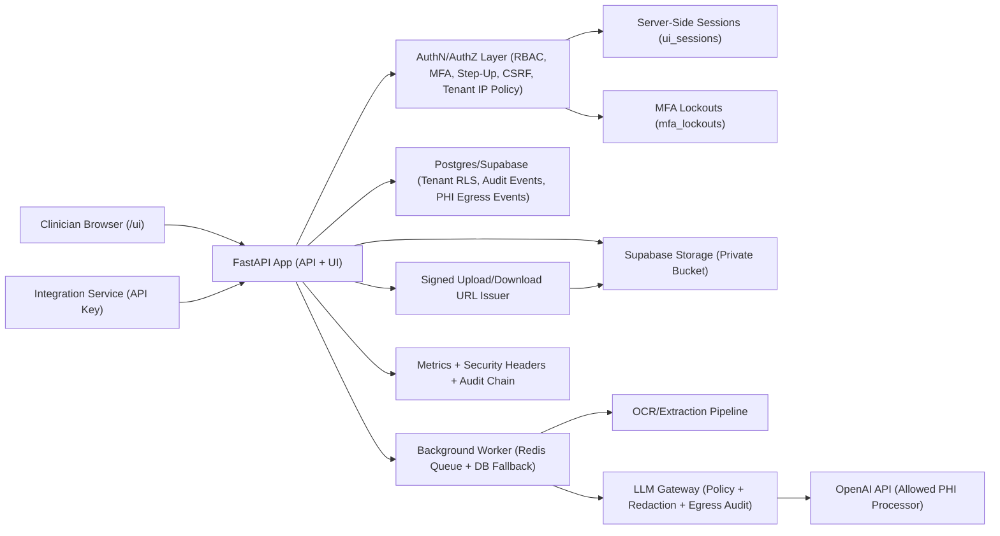
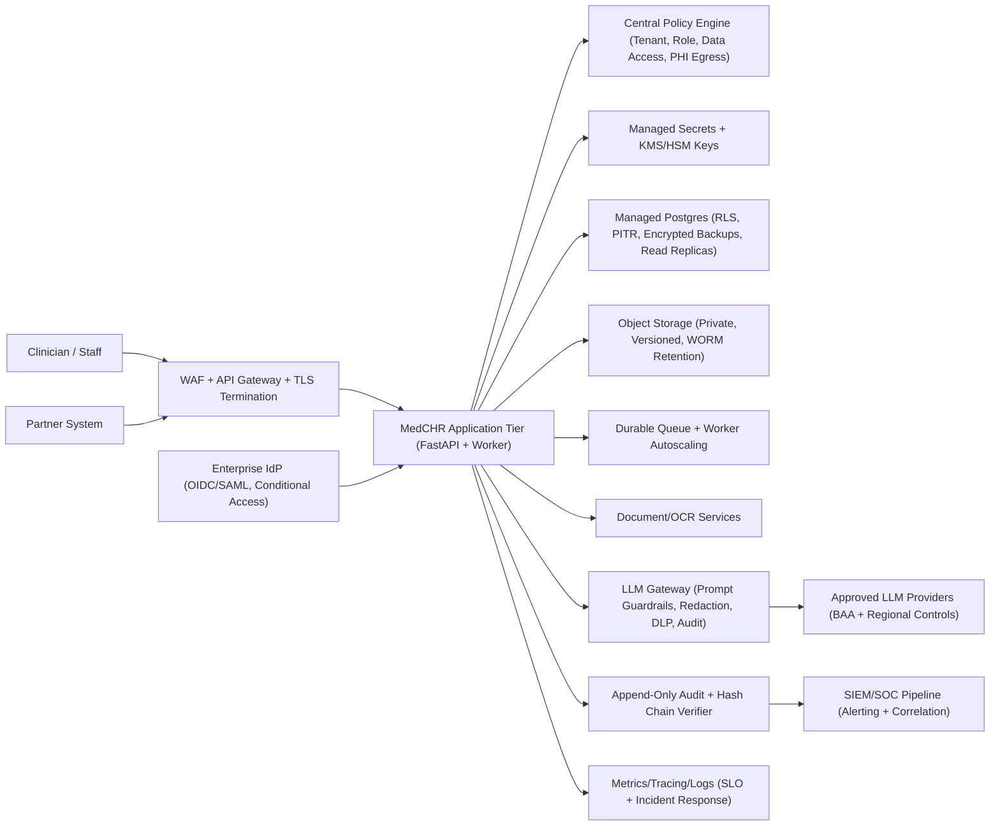

# MedCHR Architecture (Current vs Target)

Date: 2026-02-06  
Scope: runtime architecture for enterprise healthcare-grade posture

## Current Implemented Architecture

## Target Enterprise Healthcare Architecture

## What Remains to Reach Target
- Move from app-level controls to defense-in-depth at edge/network (WAF, DDoS, mTLS/service mesh where required).
- Add managed key lifecycle (KMS/HSM rotation, break-glass process, key-use audit review).
- Expand audit evidence automation to include periodic access certification and control attestations.
- Add runtime detection controls (SIEM integration, anomaly detection on PHI access, on-call playbooks linked to alerts).
- Formalize deployment governance (environment segregation, change approval, mandatory production gate checks).

## LLM Position in Architecture
- The architecture is explicitly LLM-enabled.
- LLM usage is constrained behind `backend/app/llm_gateway.py` and treated as controlled PHI egress.
- In enterprise mode, only approved providers with BAAs should be enabled in `PHI_PROCESSORS`.
